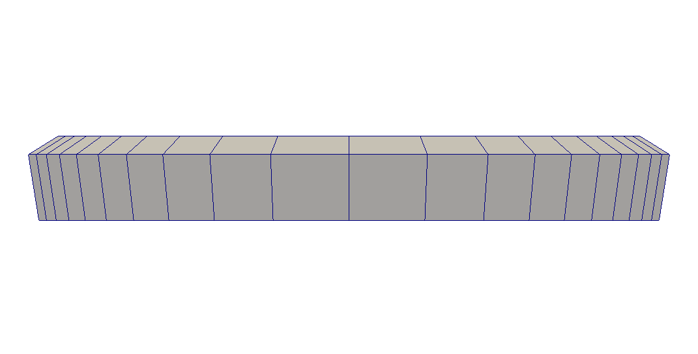
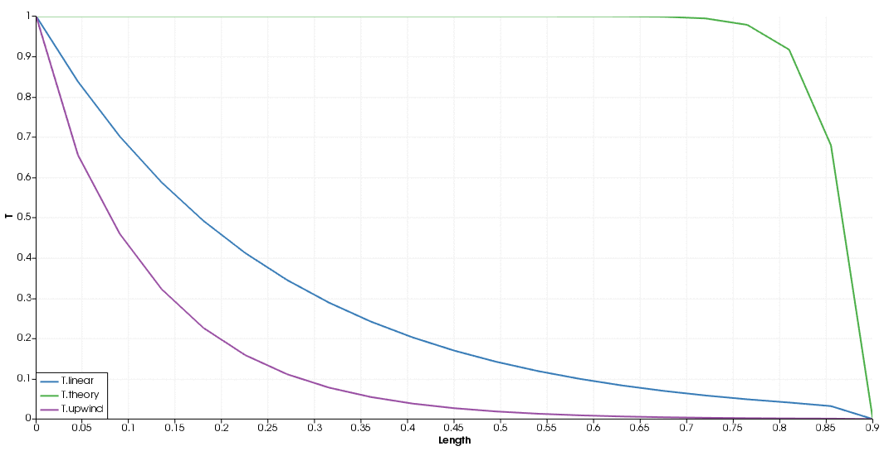
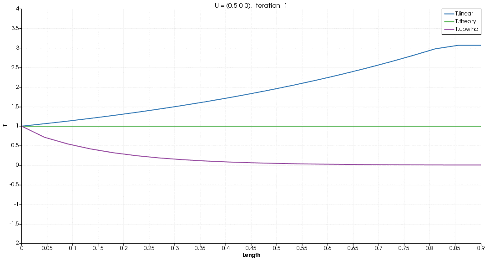

> This assignment assumes you went through all lectures in the "OpenFOAM simulation in a nutshell" module

# Assignment for "OpenFOAM simulation in a nutshell" lectures

## Goals

- Become confident in basic OpenFOAM simulations
- Practice setting up OpenFOAM simulations
- Practice basic ParaView visualization mechanisms.

## Basic-level skills

If you haven't done so yet, clone the demo case and switch to `EndOfPreprocessing` stage:

```bash
> run
> git clone https://github.com/FOAM-School/res-eng-openfoam-intro intro
> cd intro
> git checkout EndOfPreprocessing
```

### Getting ready for the assignment

Before we start, I want you to make some changes to the case:

- Remove (Or comment out) the `maxIter  1;` from `fvSolution.solvers.T`
   dictionary.
- Set `tolerance  1e-7;` in the same dictionary.
- In `system/controlDict`, change `endTime` from 40 to 3.

Run `blockMesh && scalarTransportFoam` to get a grasp of the state of the simulation (forming a baseline).

1. Note that, with the above setup, the iterative solver converges in the first "timestep". How many 
   iterations did it take? Hint: look for the line: `smoothSolver:  Solving for T ...` in solver output. 
2. Check **T** values in `2/T` for example. Better yet, run the following command to
   produce a table of **T** values similar to the ones shown in the lectures
   (Note that **T** doesn't change beyond the first iteration):
   ```bash
   > for Tdict in $(ls --sort version *[^g]/T); do grep -e "internalField" $Tdict; done
   ```

Now, clean the case to proceed: `foamCleanTutorials && blockMesh`

### Playing with "Initial Conditions" and simulation convergence

> Note that this is a steady-state simulation; By **Initial Conditions**,
> we mean the initial state of **T** variable for the iterative solver (Gauss Seidel)

In the lectures, we used zeroed initial state for **T**. Let's change it to a more logical one:

```cpp
///   In 0/T
internalField nonuniform List<scalar> 9(0.95 0.9 0.8 0.7 0.6 0.5 0.4 0.2 0.1);
```
Run the case again and answer the following questions (based on solver log and T values in the first 3 timesteps):

1. How many iteration did it take to converge? How many "timesteps" were required?
2. Is there (Do you expect) any difference in the final solution (from the previous initial state)?
3. Fill in the following table and identify the stopping criterion (`tolerance` or `relTol`)

   | TimeStep | Initial Residual | Final Residual | Per-Timestep Convergence Criterion |
   |----------|------------------|----------------|--------------------|
   |    1st   |                  |                |                    |
   |    2nd   |                  |                |                    |
   |    3rd   |                  |                |                    |

Clean the case (`foamCleanTutorials && blockMesh`), and increase the velocity to (1 0 0)

4. Run the solver again and see what happens. Keep in mind this scenario, we'll back to it later.
5. Run the solver again with the velocity set to (0.3 0 0). Can you deduce the maximum number of linear iterations allowed per timestep? (remember that we have *removed* `maxIter 1;` from `fvSolution.solvers.T`)
6. What we did in question 4 made the iterative method "incapable" of **solving** the system of equations.
   And question 5 made the iterative method "incapable" of converging. Which case is hardest to figure out?
7. Here is an even harder case, try U = (0.15 0 0). Does the simulation converge?
   What about the accuracy of the results? The theoretical solution has the same form as in the lecture but 
   `a = -2.056441e-7, b = 0.15`.

> I think I made the point here, convergence doesn't mean the result are accurate.
> Don't forget to get the velocity back value to (0.03 0 0). 

### Iterative solvers and preconditioners

Let's now experiment with more linear solvers. To figure out what kind of iterative solvers are available for the
**T** field, we can replace `fvSolution.solvers.T.solver` with "somthing" (for example, we know there is no iterative 
solver named something), and then run `scalarTransportFoam`.

This will cause OpenFOAM solvers to display a list of available iterative solvers for the field.
```bash
--> FOAM FATAL IO ERROR: 
Unknown asymmetric matrix solver something
Valid asymmetric matrix solvers are :

12
(
BICCG
BiCG
BiCGStab
FPEAMG
GAMG
GMRES
MPEAMG
PBiCG
RREAMG
amgSolver
deflation
smoothSolver
)
```
> Different OpenFOAM forks will offer a different set of iterative solvers.

The error lists all available solvers for asymmetric matrices (which is the type of our matrix).

1. Instead of "something" as the iterative solver, try **PBiCG** (Preconditioned Bi-conjugate gradient). Run `scalarTransportFoam` and see what happens (read through the error).

> Hint: PBiCG (and many others) require a "preconditioner" which is an operation applied to the matrix before solving the system of equations to improve its condition number ( get
> 
> near the value 1, where **M** is the matrix in question)

2. You can now include `preconditioner    something;` in `fvSolution.solvers.T` dictionary to get a list 
   of available pre-conditioners.

3. Pick, `preconditioner   diagonal;` (The simplest one), try the following iterative solvers 
   (All are variants of the Krylov-space CG solver) and complete the table:

   | Iterative solver | Number of Iterations to converge | Final Residual |
   |------------------|----------------------------------|----------------|
   |       PBiCG      |                      | |
   |     BiCGStab     |                      | |

> If there is an iterative solver you want to learn more about, the source code can give you
> a fairly sufficient amount of information (no C++ knowledge is required, just read the description)
> : `find $FOAM_SRC -iname "PBiCG*H"` for example (the H is there to get only the "header files").

4. How do these solvers perform if compared to the Gauss Seidel Method?
5. Reservoir Engineers use more the GMRES (Generalized Minimal RESidual method, another Krylov-space method) 
   in their simulations.
   So, let's try it out. Set `fvSolution.solvers.T.solver` to GMRES, and run `scalarTransportFoam`.
   The iterative solver requires that you specify the Krylov-space dimensions 
   (`nDirections  5;` is what I usually do: we know 9 dimensions would solve the problem 
   in a single **iteration**. But, do try different values for `nDirections` - between 1 and 9 -).

6. Another family of iterative solvers (other than Krylov-Space ones) is the multi-grid family. Those
   are the iterative solvers that solve the matrix on different levels of mesh density (starting from 
   the most coarse mesh and building up to reach the finest one). An example of such solvers is **GAMG**
   (Geometric-Algebraic Multi-Grid) which can apply the agglomeration on mesh cells directly (the Geometric
   approach) or on matrix coefficients only (the Algebraic approach).
   Set `fvSolution.solvers.T.solver` to `GAMG` and `scalarTransportFoam`. You know the drill.
   Just add any keywords that the solver says are missing, with a dummy value ("something" for example) to get
   a list of available options each time. It's recommended to pick the following configuration though:
   - Agglomeration type: `algebraicPair`
   - Number of cells in coarsest mesh level: sqrt(nCells) is usually good. In this case, sqrt(9) = 3.
     But do try 4 and 2 afterwards.
   - Merge agglomeration Levels should be set to 1 (enabled).
   - Keep `GaussSeidel` as the smoother.
   
> Note that we tried a whole bunch of iterative solvers without touching the smoother keyword.
> Some of these methods indeed required the presence of this keyword, and some of them didn't use it at all.
> But OpenFOAM didn't complain about it.

7. One last thing to do is to try out different preconditioners for this matrix. Set `fvSolution.solvers.T.solver`
   to **PBiCG** and change the preconditioner each time:
   
   | Preconditioner | Number of Iterations to converge | Final Residual |
   |------------------|----------------------------------|----------------|
   |      diagonal      |                      | |
   |      DILU     |                      | |
   |      SymGaussSeidel     |                      | |

## Intermediate-level skills

I think the basic-level section made it clear that the best configuration to use is the **PBiCG** as the solver and
**DILU** as its preconditioner. So, we'll continue with this configuration.

### Mesh Density

What if we increase cells number in our domain? from 9 to 20, 300, 10000 (focus on iteration number per timestep). 

> Cell Size issues usually arise in transient simulations. As this is a steady-state one, we
> are relatively safe. We can go for 100000 cells without problems (capturing a change of the order 1e-5 in T value
> between cell centers).

The procedure to change the cell number is as follows:

- In `constant/blockMeshDict.blocks`, we change the 9 in `hex (0 1 2 3 4 5 6 7) (9 1 1) simpleGrading (1 1 1)`
  to whatever we like.
- Re-Build the mesh and check its quality (with `blockMesh && checkMesh`) 

### Using Jupyter Notebooks to manage case reports

> You have to add `-L 8888:localhost:8888` to the 
> SSH command you access the server with for things to work.
> `ssh -xC -i ~/.ssh/remotesshkey.pem -L 8888:localhost:8888 linux1@xxx.xxx.xxx.xxx`

It's probably best to keep a Jupyter Notebook for the case as an "Interface". 
Instead of going through each file in the case - trying to figure out what's going on -
you can document important operations easily within a notebook.

Our case repository has a tag for a Jupyter Notebook built with PyFoam. It does require some Python knowledge to make sense of all the things in there, but I believe you can pick Python as you go through the notebook.

Inside the docker container, run the following command (everything is already set up so you can run this
easily):

```bash
> git reset --hard IntroNotebook
> jupyter notebook --ip=0.0.0.0 --port=8888 --allow-root
```

Then, in your local browser, go to the link displayed in the terminal
(should start with http://127.0.0.1:8888/?token=....).

> This works because by 127.0.0.1, we mean the localhost (from your point of view,
> this points to your machine; and from the container's point of view, it points to the container's
> localhost). The container's 8888 port is forwarded to the remote server 8888 port 
> (if you're using the recommended setup), which is also forwarded to your local 8888 port
> with the SSH command above.

In Jupyter home page, click on the `intro.ipynb` file to bring up the notebook.
Read through it, and execute code cells one by one with Ctrl+Enter.

## Advanced-level skills

From the manual solution lecture, we can deduce our results are **not** that accurate. This section
tries to investigate deeper on why the results have such moderate errors.

Before starting, checkout the **IntroNotebook** stage, and perform the following changes:

- Change `endTime` from 40 to 5.
- Change the linear solver for **T** equation to `PBiCG` with `DILU` as its preconditioner.
- Change the solver's absolute tolerance to `1e-10` and remove (or comment out) the `maxIter` entry.
- Change the diffusivity coefficient in `constant/transportProperties` from 0.01 to **0.1**.
- Make sure U = (0.03 0 0) is set as initial conditions for the velocity.

When it comes to simulation accuracy, mesh size generally plays a decent role. Let's inspect what refining 
the mesh may bring to the table:

### Finer Meshes.

This repository contains a folder **finerMesh** which provides the following field files to make
it easier to compare OpenFOAM results to the theoretical ones:

- `T.theory.9cells`: Theoretical T field at cell centers mapped to 9 cells.
- `T.theory.20cells`: Theoretical T field at cell centers mapped to 20 cells.
- `T.theory.50cells`: Theoretical T field at cell centers mapped to 50 cells.
- `T.theory.200cells`: Theoretical T field at cell centers mapped to 200 cells.

Note the domain length is **always** 0.9m, we just increase the number of cells within this domain each time.

In Foam-Extend, and other older OpenFOAM versions, we rely on the `foamCalc` utility to perform simple
calculations on fields without going through the trouble of "ParaViewing things".

> Newer versions of Mainline OpenFOAM have replaced this utility with `postProcess`, which has a similar
> commandline interface

For this particular case, we are interested in the difference between two fields (the one the simulation generates, and
the theoretical one) at `endTime`. For this task, you can run the command:

```bash
> foamCalc addSubtract T subtract -field T.theory.9cells -time 5
```
To calculate the difference between your simulated field and the provided theoretical one at time 5.
This "difference" is written as a field in 5 directory, and named as `T_subtract_T.theory.9cells`.

You're asked to change the mesh density, rerun the simulation, and compare your results to theoretical fields:


| Cell Count  | Order of magnitude of the difference |
|-------------|--------------------------------------|
|      9      |          1e-4            |
|      20     |                          |
|      50     |                          |
|      200    |                          |

1. Do you think refining the mesh helps?
2. Do you think refining the mesh *further* can help? Remember we're splitting a 0.9m-long to more than 200 cells
   where the velocity is 0.03 m/s (fluids run through the domain in half a second).
3. How about refining regions of the mesh (eg. near boundaries) and ignoring others? This repo's directory: 
   **gradedMesh** provides the required `blockMeshDict` to generate a "graded" mesh. Just copy it to `constant/polyMesh`
   and run `blockMesh`:
   
   
   
   Basically, instead of specifying only one mesh block, we split our domain into two domains; where we multiply
   cellSize in one block by 10 and by 0.1 in the other (following the same x-direction) to get smaller 
   cell size near boundaries and larger ones twards the center:
   
   
   
   We have used the mesh with 20 cells as a baseline; so rerun the simulation with the graded mesh and compare
   the order of errors (a file holding theoretical **T** at the new mesh cell centers is provided).

> May be a factor of 0.1 was a bit of a stretch in this case, but you get the point.

### The problematic div(phi, T) term.

Now get back to the 9-cells case, and set U = (0 0 0) to fall-back to a pure diffusion case; where 
the theoretical profile of **T** is linear: `T(x) = 1-10x/9`

1. Run the solver. How the errors look in this case?
2. From the previous question, we conclude the divergence term is introducing some
   instabilities. So, set U = (0.03 0 0) again and let's change the `div` scheme for that specific 
   term a couple of times and see what happens.
   Which of the following schemes is the **least** accurate in this case:
     - `Gauss linear`
     - `Gauss upwind`
     - `Gauss vanLeer` (A TVD scheme)

> Replace "linear" with "anything" in `Gauss linear;` and run the solver 
> to get a list of available schemes.

`upwind` is known for its "stability", which causes the loss of accuracy: It's a tradeoff! That's why It's
always recommended to start with `upwind` for div. terms, then improve on things one the case is running file.
Let's now challenge its stability:

The most "correct" way to evaluate a solver's stability from a practical point of view
is to get back to GaussSeidel with 40 iterations and `maxIter 1` settings;
and then plot **T** values over the domain at each timestep (easy enough with ParaView).

For this task; we can write a shell script to automate things a bit:

> Please go back to a clean state of the `IntroNotebook` tag: `git reset --hard`

```bash
#!/bin/bash
# File: compareLinearAndUpwind.sh

# Make sure the div scheme is linear
sed -i 's/div(phi,T).*;/div(phi,T)  Gauss linear;/' system/fvSchemes
scalarTransportFoam
for item in `ls -v */T`;
do
   cp $item "$item.linear";
   sed -i 's/object.*;/object T.linear;/' $item.linear;
done

# Do the same for the upwind case

sed -i 's/div(phi,T).*;/div(phi,T)  Gauss upwind;/' system/fvSchemes
scalarTransportFoam
for item in `ls -v */T`;
do
   cp $item "$item.upwind";
   sed -i 's/object.*;/object T.upwind;/' $item.upwind;
done
```

Make the file executable and execute it:
```bash
> chmod +x compareLinearAndUpwind.sh && ./compareLinearAndUpwind.sh
```

The following results are obtained by setting K = 0.01 and U = (0.3 0 0) with cell count = 20,
which are then compared to theoretical solution (sampled only at cell centers):



Increasing U to 0.5 m/s and making the outlet a free boundary (**zeroGradient** type on T field); we 
get the following results (compare the stability of linear vs. upwind):


